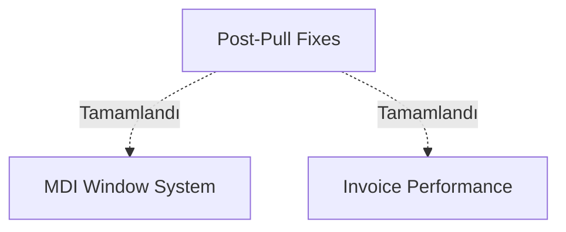

# Plan İndeksi

**Son yenilənmə:** 2025-12-16T10:04:00+04:00

Bu fayl layihənin bütün planlarının master cədvəlidir. AI agent və komanda üzvləri bu cədvələ baxaraq aktiv, tamamlanmış və arxivlənmiş planları görə bilər.

---

## 🟡 Aktiv Planlar

| ID | Plan Adı | Status | Prioritet | Tərəqqi | Başlama | Son Yenilənmə | Məsul | Fayllar |
|----|----------|--------|-----------|---------|---------|---------------|-------|---------|
| 001 | MDI Window System | 🟡 Davam edir | Yüksək | 60% | 2025-12-09 | 2025-12-15 | AI Agent | [Plan](active/001-mdi-window-system.md) |
| 002 | Invoice Performance Optimization | 🆕 Yeni | Orta | 0% | 2025-12-10 | 2025-12-10 | AI Agent | [Plan](active/002-invoice-performance.md) |

**Cəmi aktiv planlar:** 2

---

## ✅ Tamamlanmış Planlar

| ID | Plan Adı | Tamamlanma Tarixi | Tərəqqi | Qeydlər | Fayllar |
|----|----------|-------------------|---------|---------|---------|
| 003 | Page Window Infinite Loop Bug Fix | 2025-12-16 | 100% | Layout wrapper sonsuz dövrəyə səbəb olurdu | [Plan](completed/003-page-window-infinite-loop-fix.md) |
| 000 | Post-Pull Error Fixes | 2025-12-15 | 100% | TypeScript və backend xətaları həll edildi | [Plan](completed/000-post-pull-fixes.md) |

**Cəmi tamamlanmış planlar:** 2

---

## 📦 Arxivlənmiş Planlar

| ID | Plan Adı | Arxivlənmə Səbəbi | Tarix | Fayllar |
|----|----------|-------------------|-------|---------|
| - | - | - | - | - |

**Cəmi arxivlənmiş planlar:** 0

---

## 📊 Statistika

- **Ümumi planlar:** 4
- **Aktiv:** 2
- **Tamamlanmış:** 2
- **Arxivlənmiş:** 0
- **Ümumi tərəqqi:** 65% (260/400 task points)

---

## 🎯 Prioritet Sırası

1. 🔴 **Kritik:** -
2. 🟠 **Yüksək:** MDI Window System (001)
3. 🟡 **Orta:** Invoice Performance Optimization (002)
4. 🟢 **Aşağı:** -

---

## 🔗 Asılılıqlar

---

## 📝 Son Dəyişikliklər

### 2025-12-16
- Plan idarəetmə sistemi yaradıldı
- Mövcud planlar migrate edildi
- PLAN_INDEX.md ilk versiyası

### 2025-12-15
- Plan 000 tamamlandı (Post-Pull Error Fixes)

### 2025-12-10
- Plan 002 yaradıldı (Invoice Performance)

### 2025-12-09
- Plan 001 yaradıldı (MDI Window System)

---

## 💡 Növbəti Addımlar

1. Plan 001-i tamamlamaq (Window focus handling problemi həll et)
2. Plan 002-yə başlamaq (Invoice performance optimizasiyası)
3. Yeni planlar əlavə etmək (əgər lazımdırsa)

---

**Qeyd:** Bu fayl avtomatik yenilənir. Əl ilə dəyişiklik etməyin, plan fayllarını yeniləyin.
